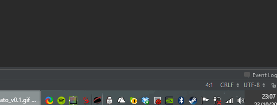

GATO - Gamedev Auxiliary TOol
====

 

  GATO mostly sits on your taskbar, wasting a few resources and looking pretty. Occasionally it may turn out to be useful (like it's namesake).
  Right clicking on it will display a list of shell tasks, which are read from a yaml file. These tasks can be quite useful for game development and may include:
  * Link to your Issues page
  * Go to your current project's wiki
  * Pull changes from several repositories
  * Open your entire work toolset 
  * Setup a newly-formated PC for work
  * etc
  

Dev Notes
========

This is meant to be as intuitive as possible in order to be used by non-programmers.

Inspired by [this blog post](http://blog.spaceduststudios.com/tools-and-processes-for-remote-game-development-part-2-collaboration).
